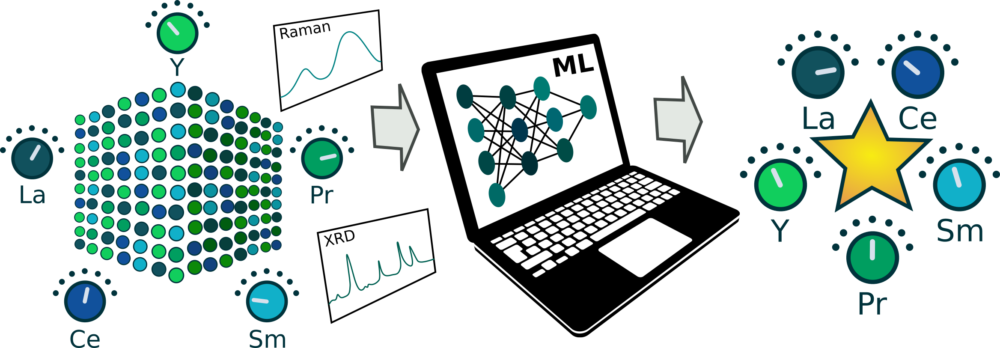

# ML4HEOs
Machine Learning methods for high entropy oxides

# Paper
**Phase-property diagrams for multicomponent systems**  
Leonardo Velasco, Juan S. Castillo, Kante M. Veerraju, Jhon J. Olaya, Pascal Friederich, Horst Hahn  
*Karlsruhe Institute of Technology*

# Contact
- High entropy alloys, experiments:leoveles@gmail.com  
- Machine learning: pascal.friederich@kit.edu

# Requirements
- python 3.x
- Tensorflow 2 and Keras

# Data
- All data used from our paper can be found in the data directory

# Machine Learning
- All python scripts can be found in the code directory
- The convolutional neural networks described in the paper can be trained using the train_NN_xrd.py script
- New synthetic data using reference XRD diffractograms can be generated using the generate_synthetic_data.py script
